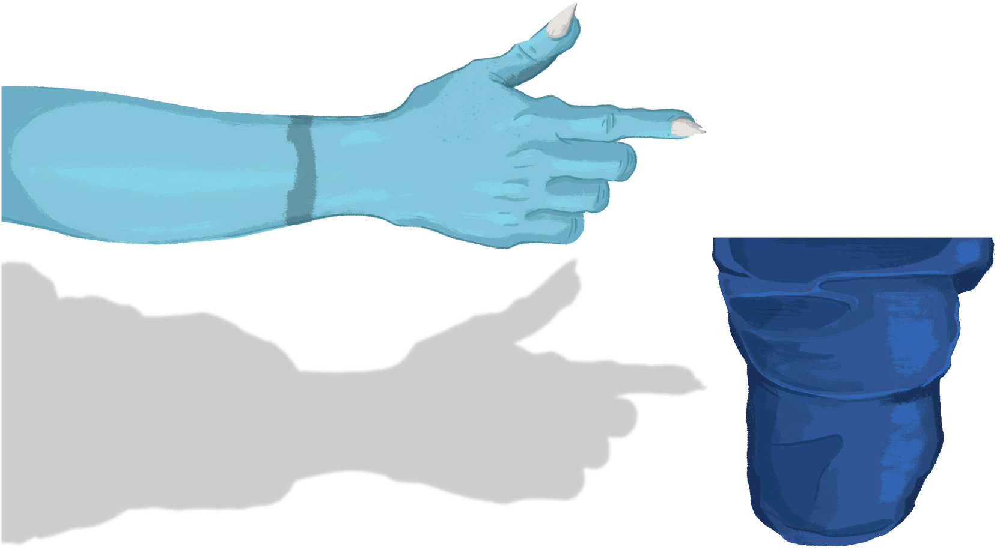
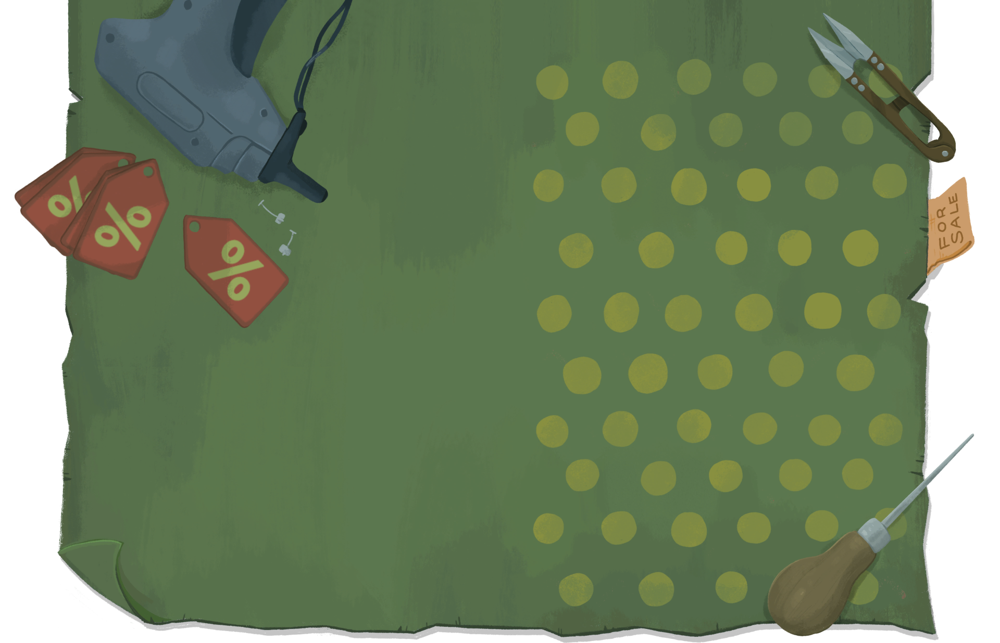

# STS2 Shop Keeper — OpenPeon Sound Pack

<p align="center">
  
</p>

<p align="center">
  <i>"Welcome. Support your local business."</i><br/>
  An <a href="https://openpeon.com">OpenPeon</a> (CESP v1.0) sound pack of
  Merchant &amp; Reverse Merchant voice lines from
  <i>Slay the Spire 2</i> (2026, Mega Crit).
</p>

<p align="center">
  <a href="#installation">Install</a> ·
  <a href="#categories">Categories</a> ·
  <a href="#source">Source</a> ·
  <a href="#copyright--fair-use-notice">License</a>
</p>

---

Every grunt, laugh, and disappointed *"어허"* the shop keeper can muster,
wired into your Claude Code / Codex / IDE events.

## Installation

```sh
git clone https://github.com/flavono123/sts2-shopkeeper-peon.git
peon packs install-local sts2-shopkeeper-peon
peon packs use sts2_shopkeeper
```

Preview any category:

```sh
peon preview session.start
peon preview task.error     # "어허"
peon preview user.spam      # reverse merchant heckles
```

## Categories

Mapped from the game's internal `sts2_sfx_VO_merchant_*` /
`sts2_sfx_VO_reverse_merchant_*` events in `sfx.bank`.

| CESP event         | Game event                                | Clips |
|--------------------|-------------------------------------------|------:|
| `session.start`    | `merchant_welcome`                        |     4 |
| `task.acknowledge` | `merchant_laughter`                       |     2 |
| `task.complete`    | `merchant_thank_yous`                     |     3 |
| `task.error`       | `merchant_dissapointment` *(sic)*         |     3 |
| `input.required`   | `merchant_passive`                        |     2 |
| `resource.limit`   | `reverse_merchant_hurt_sad` + `_die`      |     7 |
| `user.spam`        | `reverse_merchant_hehe`                   |     6 |

> The Merchant handles the normal flow. The Reverse Merchant (짭상인) —
> the swindler on the shady rug, hawking half-price relics — covers the
> sadder, spammier states. You're on thin ice when you hear him.

<p align="center">
  
  &nbsp;
  
</p>

**27 clips total · ~8.8 MB · 48 kHz stereo WAV**

## Source

Audio is extracted from the game's FMOD Studio sound banks:

1. Extract `Slay the Spire 2.pck` with
   [GDRE Tools](https://github.com/GDRETools/gdsdecomp):
   ```sh
   "Godot RE Tools.app" --headless \
       --recover="/path/to/Slay the Spire 2.pck" \
       --output-dir=extraction
   ```
2. Decode the merchant subsongs from `extraction/banks/desktop/sfx.bank`
   with [vgmstream](https://github.com/vgmstream/vgmstream):
   ```sh
   vgmstream-cli -s <subsong_n> -i -o "?n.wav" \
       extraction/banks/desktop/sfx.bank
   ```

All 27 merchant VO streams were extracted, renamed for clarity (the
game's `dissapointment` typo corrected to `disappointment` in filenames
only — the `sfx.bank` event name still carries the typo), and mapped
to CESP categories by emotional context.

## Copyright & Fair Use Notice

The audio clips in this pack are short excerpts of voice lines from
*Slay the Spire 2*, copyright © 2026 Mega Crit, LLC. All rights reserved
by the original owners. Character artwork in `assets/` is likewise
Mega Crit property.

**This pack is:**
- **Non-commercial** — not sold, not monetized
- **Fan-made** — created out of appreciation for the game
- **Minimal in scope** — only short merchant VO grunts and a couple of
  illustrative asset thumbnails are included; no music, no full scenes,
  nothing that could substitute for the original game

This project makes no claim of ownership over any Slay the Spire 2
assets. If Mega Crit or any rights holder objects to this use, the repo
will be taken down promptly upon request.

The pack manifest, scripts, and documentation in this repository are
licensed under [CC-BY-NC-4.0](https://creativecommons.org/licenses/by-nc/4.0/).
Audio and image assets themselves remain the property of their
respective copyright holders.

## Disclaimer

This is an unofficial fan project and is not affiliated with, endorsed
by, or sponsored by Mega Crit, LLC.
